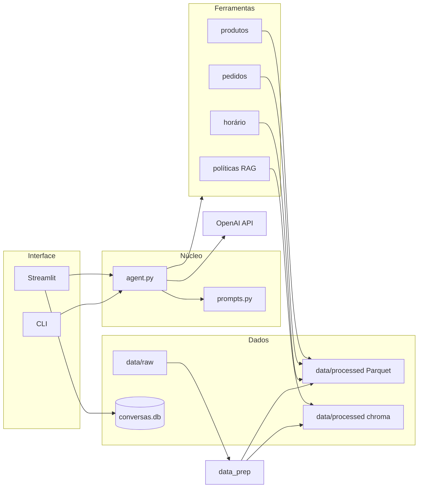

# Empório da Música — Agente de atendimento

Protótipo de **agente conversacional por texto** para o desafio técnico de **AI Engineer (Artefact)**. A loja fictícia **Empório da Música** fica em Campo Grande/MS; a assistente virtual se chama **Lúcia**.

O agente responde com base em **dados reais do desafio** (CSVs + PDF de políticas) e na **API OpenAI**, usando **function calling** nativo — sem framework de agentes. Não inventa preços, estoque, pedidos ou regras da loja.

**Repositório:** https://github.com/Jkbarros/projeto-artefact

**Guia rápido para quem vai avaliar (localhost):** [docs/instrucoes_avaliador_localhost.md](docs/instrucoes_avaliador_localhost.md)

---

## O que a plataforma oferece

| Área | Capacidades |
|------|-------------|
| **Catálogo** | Busca por termo, categoria e faixa de preço; detalhe de produto; promoções vigentes |
| **Pedidos** | Listar pedidos do cliente (e-mail/telefone); consultar status, itens e rastreio com **validação de identidade** |
| **Políticas** | Perguntas sobre endereço, horários, pagamento, troca, garantia, frete etc. via **RAG** no PDF |
| **Horário** | “A loja está aberta agora?” com fuso `America/Campo_Grande` |
| **Conversa** | Histórico por sessão em **SQLite**; retomar conversas anteriores na UI |
| **Idiomas** | Português ou inglês (seletor na interface; dados permanecem em PT) |
| **Transparência** | Modo verbose na CLI e checkbox na UI para ver **ferramentas e argumentos** chamados |
| **Qualidade** | Suite **pytest** + **ruff**; pipeline de dados reproduzível |

**Fora de escopo (por design):** criar pedidos, alterar cadastro, e-commerce completo ou acessórios avulsos (a loja só vende instrumentos, conforme o manual).

---

## Arquitetura



1. O usuário envia mensagem (Streamlit ou terminal).
2. `agent.py` monta o system prompt (persona Lúcia + idioma) e chama o modelo com as **7 ferramentas** registradas.
3. O loop executa até **8 iterações** de tool calls e devolve a resposta final.
4. Catálogo/pedidos/promoções vêm de **Pandas** sobre Parquets; políticas vêm de **busca vetorial** (Chroma + embeddings OpenAI).

---

## Ferramentas do agente

| Ferramenta | Função |
|------------|--------|
| `buscar_produtos` | Listagem com filtros (termo, categoria, preço, estoque) |
| `consultar_produto` | Preço, estoque e descrição por ID ou nome |
| `consultar_promocoes` | Promoções ativas com desconto calculado |
| `listar_pedidos_do_cliente` | Números de pedido após validar e-mail/telefone |
| `consultar_pedido` | Detalhes do pedido só se a identidade confere com o dono |
| `consultar_politicas` | Retrieval no manual `políticas_da_loja.pdf` |
| `loja_aberta_agora` | Aberta/fechada conforme horário do manual + relógio local MS |

Implementação: `src/emporio/tools/`. Schemas OpenAI: `src/emporio/tools/registro.py`.

---

## Estrutura do projeto

```
projeto-artefact/
├── data/
│   ├── raw/                 # CSVs e PDF originais (intocados)
│   └── processed/           # Parquets, Chroma, SQLite (gerados; ver .gitignore)
├── docs/                    # Decisões, suposições, tratamento de dados, uso de IA, instruções
├── exemplos/                # Conversas de exemplo do agente (entregável)
├── src/emporio/
│   ├── agent.py             # Loop function calling
│   ├── prompts.py           # Persona Lúcia + bilíngue
│   ├── llm.py / config.py
│   ├── memory.py            # Persistência SQLite
│   ├── data_prep.py         # Pipeline Parquet + RAG
│   ├── app_streamlit.py     # Interface web
│   ├── cli.py               # Chat no terminal
│   ├── dados/               # Carga bruta, transformação, repositório
│   ├── rag/                 # PDF → chunks → Chroma
│   └── tools/               # Ferramentas expostas ao modelo
├── tests/
├── .env.example
└── requirements.txt
```

---

## Pré-requisitos

- **Python 3.12+**
- Conta **OpenAI** com chave de API e saldo para chat + embeddings (`text-embedding-3-small` no RAG)
- Git (para clone)

---

## Como rodar

### 1. Clone e ambiente virtual

**Windows (PowerShell):**

```powershell
git clone https://github.com/Jkbarros/projeto-artefact.git
cd projeto-artefact
py -3.12 -m venv .venv
.\.venv\Scripts\Activate.ps1
pip install -r requirements.txt
```

Se `Activate.ps1` falhar por política de scripts, use:

```powershell
Set-ExecutionPolicy -Scope Process -ExecutionPolicy Bypass
.\.venv\Scripts\Activate.ps1
```

Ou chame o Python do venv diretamente: `.\.venv\Scripts\python.exe` (veja o guia do avaliador).

**macOS / Linux:**

```bash
python3.12 -m venv .venv
source .venv/bin/activate
pip install -r requirements.txt
```

### 2. Variáveis de ambiente

```powershell
copy .env.example .env   # Windows
# cp .env.example .env   # Unix
```

Edite `.env` e defina `OPENAI_API_KEY`. **Não commite** o arquivo `.env`.

Teste a chave:

```powershell
$env:PYTHONPATH = "src"
python -m emporio.testar_conexao
```

### 3. Preparar dados (obrigatório após o clone)

Os Parquets e o índice RAG **não** vão no Git. Rode uma vez (ou após mudar `data/raw/`):

```powershell
$env:PYTHONPATH = "src"
python -m emporio.data_prep
```

Sem custo de embedding (só Parquets): `python -m emporio.data_prep --sem-rag`

Detalhes: [docs/tratamento_dados.md](docs/tratamento_dados.md)

### 4. Interface web (recomendado)

```powershell
$env:PYTHONPATH = "src"
python -m streamlit run src/emporio/app_streamlit.py
```

Abra a **Local URL** do terminal (em geral http://localhost:8501).

Na **sidebar**: nova conversa, histórico de sessões, idioma PT/EN, “Mostrar ferramentas usadas”, apagar conversa.

Na primeira execução do Streamlit, pode aparecer um prompt de e-mail da Streamlit — pressione **Enter** em branco ou defina `STREAMLIT_BROWSER_GATHER_USAGE_STATS=false`.

### 5. CLI (alternativa)

```powershell
$env:PYTHONPATH = "src"
python -m emporio.cli --verbose --idioma pt
```

Digite `sair` para encerrar.

### 6. Testes e lint

```powershell
$env:PYTHONPATH = "src"
pytest
ruff check src tests
```

A maior parte dos testes não exige chamadas à API OpenAI.

---

## Decisões técnicas (resumo)

| Tópico | Escolha |
|--------|---------|
| LLM | OpenAI (`OPENAI_MODEL`, padrão `gpt-4o-mini` no `.env.example`) |
| Agente | Function calling nativo, loop em `agent.py` |
| Dados estruturados | Pandas + funções parametrizadas (sem SQL livre gerado pelo modelo) |
| Políticas | RAG: `pypdf` → chunks por seção → ChromaDB + embeddings OpenAI |
| UI | Streamlit; núcleo reutilizado pela CLI |
| Memória | SQLite em `data/processed/conversas.db` por `session_id` |
| Persona | Lúcia — tom acolhedor musical, até 1 emoji por mensagem |

Detalhamento: [docs/decisoes.md](docs/decisoes.md)

---

## Suposições e limitações

Ambiguidades dos CSVs/PDF estão documentadas em [docs/suposicoes.md](docs/suposicoes.md). Exemplos:

- Promoção “de hoje” = `is_active = 1` (sem datas no CSV).
- Pedido exige **número + e-mail ou telefone** do titular; listagem de pedidos só com identificação válida.
- “Loja aberta agora” não considera feriados móveis (apenas regras fixas do manual + domingo).
- Regras de arrependimento online são cruzadas com **status/data do pedido**; não há coluna “canal” em `orders`.

**Limitações conhecidas:**

- Dependência de API paga e latência de rede.
- RAG pode recuperar trechos incompletos se a pergunta for muito vaga; o prompt orienta a não inventar fora do contexto recuperado.
- Histórico de contexto enviado ao modelo é limitado (ver `memory.py`) para caber na janela do chat.
- Dados estáticos: não há integração com ERP ou pagamento real.

Com mais tempo: testes de integração com LLM mockado, cache de embeddings, feriados configuráveis, Docker e CI.

---

## Documentação complementar

| Documento | Conteúdo |
|-----------|----------|
| [instrucoes_avaliador_localhost.md](docs/instrucoes_avaliador_localhost.md) | Passo a passo para avaliador |
| [exploracao_dados.md](docs/exploracao_dados.md) | Análise dos CSVs e PDF |
| [tratamento_dados.md](docs/tratamento_dados.md) | Pipeline `data_prep` |
| [decisoes.md](docs/decisoes.md) | Arquitetura e justificativas |
| [suposicoes.md](docs/suposicoes.md) | Lacunas assumidas |
| [uso_de_ia.md](docs/uso_de_ia.md) | Uso de Cursor/IA no desenvolvimento |

---

## Uso de assistentes de código

O desenvolvimento usou **Cursor** (chat e agente) para estrutura inicial, ferramentas, testes e documentação. O candidato revisou decisões (OpenAI, persona Lúcia, bilíngue, commits, validação manual no Streamlit). Registro fase a fase: [docs/uso_de_ia.md](docs/uso_de_ia.md).

---

## Exemplos de conversa

Conversas reais exportadas do agente ficam em `exemplos/` (cenários de catálogo, políticas, pedido + devolução, fora de escopo). Pelo menos um caso não trivial deve mostrar as ferramentas consultadas.

---

## Licença e dados

Dados e enunciado pertencem ao processo seletivo Artefact. Código do candidato conforme política do repositório público no GitHub.
