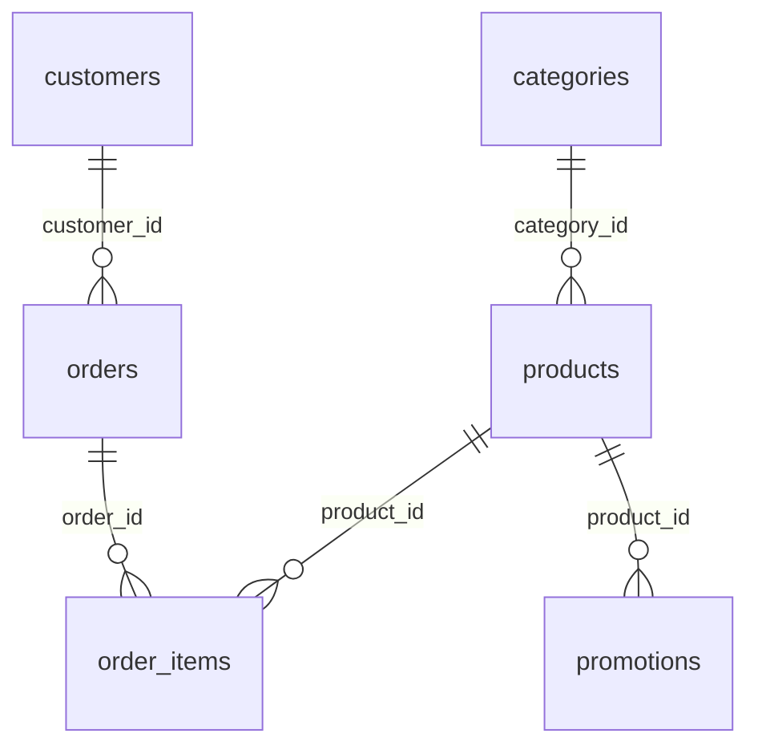

# Exploração dos dados (Fase 1)

Documento gerado após leitura dos arquivos em `data/raw/`. **Aprovado pelo candidato em 2026-10-06.**

## 1. Inventário de arquivos

| Arquivo | Linhas (dados) | Encoding |
|---------|------------------|----------|
| `desafio_tecnico_ai_eng - categories.csv` | 9 | UTF-8 |
| `desafio_tecnico_ai_eng - products.csv` | 65 | UTF-8 |
| `desafio_tecnico_ai_eng - customers.csv` | 50 | UTF-8 |
| `desafio_tecnico_ai_eng - orders.csv` | 20 | UTF-8 |
| `desafio_tecnico_ai_eng - order_items.csv` | 22 | UTF-8 |
| `desafio_tecnico_ai_eng - promotions.csv` | 25 | UTF-8 |
| `políticas_da_loja.pdf` | 8 páginas | — |

Os CSVs brutos **não devem ser editados**; tratamentos ficam para `data/processed/` (Fase 3).

---

## 2. Modelo relacional (CSVs)

### 2.1 `categories`

| Coluna | Tipo observado | Observação |
|--------|----------------|------------|
| `category_id` | int | PK |
| `name` | texto | Nome da categoria |
| `description` | texto | Descrição longa |

Categorias (ids 1–9): Guitarras, Baixos, Baterias, Teclados, **Violões (5)**, Sopros madeira/metais, Cordas orquestrais, Ukuleles.

> **Atenção ao desafio:** “violões até R$ 1.000” refere-se à categoria **Violões (`category_id = 5`)**, não a “Guitarras”.

### 2.2 `products`

| Coluna | Tipo observado | Observação |
|--------|----------------|------------|
| `product_id` | int | PK (faixa 81–145 no dataset) |
| `price_brl` | float | Já numérico (ex.: 599.9) |
| `name` | texto | Nome comercial |
| `category_id` | int | FK → `categories` |
| `description` | texto | |
| `stock_quantity` | int | Mínimo 0; **nenhum estoque negativo** |
| `status` | texto | `active` (62), `discontinued` (2), `coming_soon` (1) |
| `specs` | texto (JSON) | Atributos técnicos em JSON |
| `created_at` | texto | Datas ISO `YYYY-MM-DD` |

**Exemplo desafio — Takamine GD20:** `product_id` **95**, preço **R$ 2.199,00**, estoque **5**, categoria Violões.

**Violões até R$ 1.000:** **14** produtos em `category_id = 5` com `price_brl <= 1000`; alguns com **estoque 0** (ex.: ids 96, 113).

### 2.3 `customers`

| Coluna | Tipo observado |
|--------|----------------|
| `customer_id` | int (PK) |
| `name` | texto |
| `phone` | texto `(67) ...` |
| `email` | texto |
| `city` | texto (todas observadas: Campo Grande) |

Útil para **validação de identidade** em consulta de pedido (pedido + segundo fator).

### 2.4 `orders`

| Coluna | Tipo observado | Observação |
|--------|----------------|------------|
| `order_id` | int | PK |
| `customer_id` | int | FK |
| `order_date` | texto | `YYYY-MM-DD` (faixa **2025-10-15** a **2026-03-22**) |
| `status` | texto | `delivered` (7), `confirmed` (4), `pending` (4), `cancelled` (4), `shipped` (1) |
| `total_brl` | float | |
| `payment_method` | texto | `pix`, `credit_3x`, `credit_6x`, `credit_12x`, `boleto`, `debit` |
| `tracking_code` | texto | Muitos vazios |
| `estimated_delivery` | texto | Datas ou vazio |
| `notes` | texto | **Muitos nulos** |

### 2.5 `order_items`

| Coluna | Tipo observado |
|--------|----------------|
| `order_id` | int (FK) |
| `quantity` | int |
| `product_id` | int (FK) |

22 linhas para 20 pedidos (alguns pedidos com mais de um item).

### 2.6 `promotions`

| Coluna | Tipo observado | Observação |
|--------|----------------|------------|
| `promotion_id` | int | PK |
| `product_id` | int | FK |
| `discount_percent` | int | Ex.: 10 = 10% |
| `description` | texto | Campanha |
| `is_active` | int | **0 ou 1** (não há datas de início/fim) |

**Promoções ativas (`is_active = 1`):** 4 registros (produtos 127, 121, 90, 94).

---

## 3. Integridade referencial (checagens)

| Verificação | Resultado |
|-------------|-----------|
| `orders.customer_id` ⊆ `customers` | OK |
| `order_items.order_id` ⊆ `orders` | OK |
| `order_items.product_id` ⊆ `products` | OK |
| `products.category_id` ⊆ `categories` | OK |
| `promotions.product_id` ⊆ `products` | OK |
| Estoque negativo | **0** linhas |

---

## 4. Problemas de qualidade e tratamentos previstos (Fase 3)

| Problema | Impacto | Tratamento sugerido |
|----------|---------|---------------------|
| Nomes de arquivo com espaços e prefixo longo | Scripts frágeis | Padronizar leitura por glob ou renomear só em código interno |
| `orders.notes`, `tracking_code` vazios | Respostas “sem rastreio” | Retorno explícito na ferramenta |
| `promotions` sem vigência por data | “Promoção hoje?” ambíguo | Suposição documentada: `is_active = 1` |
| `payment_method` codificado (`credit_6x`) | Explicação ao cliente | Mapear para texto legível na camada de dados |
| Produtos `discontinued` / `coming_soon` | Catálogo | Filtrar ou sinalizar no `status` |
| PDF com extração “uma palavra por linha” (`pypdf`) | RAG/contexto ruim | Normalizar espaços e quebras na Fase 3 |

---

## 5. Manual `políticas_da_loja.pdf`

| Métrica | Valor |
|---------|--------|
| Páginas | 8 |
| Caracteres (texto extraído) | ~14.955 |
| Tokens (estimativa ÷4) | ~3.700 |

**Conclusão para arquitetura:** manual **curto o suficiente** para enviar **texto completo no contexto** ou índice por seção, sem RAG com embeddings (decisão na Fase 2).

### Tópicos identificados no PDF (para o agente)

| Tema | Conteúdo relevante (resumo) |
|------|-----------------------------|
| Identidade / missão | Loja desde 2008, Campo Grande; só instrumentos (sem acessórios avulsos) |
| Endereço e contato | Rua 14 de Maio, 3200 — Centro; CEP 79202-333; (67) 3341-4444; e-mail no manual |
| Horários | Seg–sex 09:00–18:00; sáb 09:00–13:00; domingo/feriados fechado; WhatsApp mesmo horário |
| Pagamento | PIX (5% desc.), débito, crédito até 12x, boleto; regras de parcela mínima |
| Troca e devolução | **Arrependimento online:** 7 dias corridos após recebimento; produto intacto; reembolso até 10 dias úteis; frete devolução por conta da loja |
| Defeito | Troca até **30 dias**; depois acionar garantia |
| Garantia / frete / atendimento humano | Seções posteriores do manual (detalhes na extração limpa) |

O agente **não deve inventar** prazos ou endereço: usar PDF (e pedidos para datas de compra/entrega).

---

## 6. Mapa pergunta → fonte

| Exemplo de pergunta | Fonte primária | Fonte secundária |
|---------------------|----------------|------------------|
| Violões até R$ 1.000 | `products` + `categories` | `promotions` se houver desconto ativo |
| Preço do Takamine GD20 | `products` | `promotions` |
| Endereço / horário da loja | PDF | — |
| Formas de pagamento / parcelas | PDF | `orders.payment_method` (histórico) |
| Status do pedido #N | `orders` + `order_items` | `customers` (validação) |
| Posso devolver? / arrependimento | PDF | `orders` (data, status, canal inferido) |
| Promoções de hoje | `promotions` | Suposição `is_active` |
| Loja aberta agora? | PDF (horários) | Relógio em `America/Campo_Grande` |

### Cenários sugeridos pelo desafio

| Cenário | Fontes |
|---------|--------|
| Violões até R$ 1.000 | `products` (`category_id=5`, `price_brl<=1000`) |
| Endereço | PDF § dados da empresa |
| Preço Takamine GD20 | `products` id 95 |
| “Me arrependi, posso devolver?” | PDF § 4.1 + dados do pedido (data entrega/compra) |

---

## 7. Lacunas (informação que **não** está nos dados)

- Vigência temporal real das promoções (só flag `is_active`).
- Política de escalonamento para humano: buscar texto exato no PDF na Fase 3 (seção de atendimento).
- Canal da compra (online vs loja) não está explícito em `orders` — pode afetar “arrependimento online” (ver suposições).

---

## 8. Próximo passo

**Fase 2:** decisões de arquitetura (agente, SQLite/pandas, políticas no contexto, CLI, histórico), uma por vez, com opções e recomendação.
